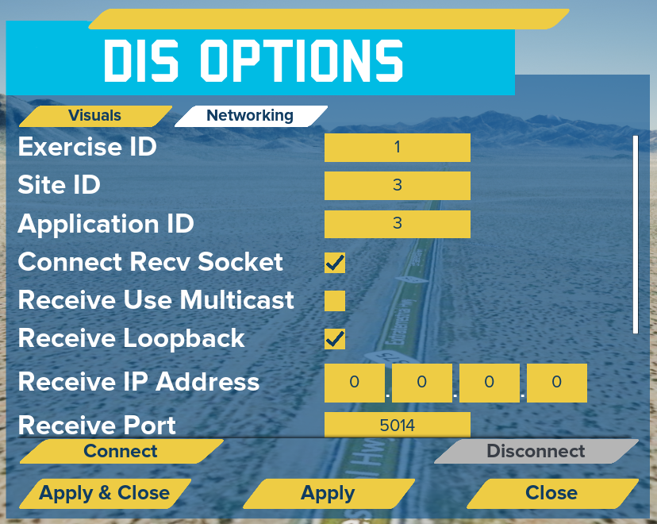
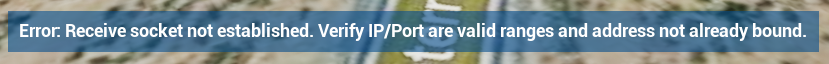

# Purpose

- The GRILLDISExample project is an demo project for the GRILL DIS for Unreal plugin, showing how to utilize features of the plugin.

# Get Started

- This example project utilizes Unreal Engine 5.0.
- [Clone this repository](# Cloning This Repository)
- Open GRILLDISExample\GRILLDISExample.uproject and allow it to build modules.

# Cloning This Repository

This repository includes a submodule that may be updated frequently. If you have cloned this repository with `git clone` you must also run the command `git submodule update --init --recursive` to ensure that the submodule code is cloned. However, you can skip this step by cloning this repository with the command `git clone [URL] --recurse-submodule`

If the submodule has already been added to the project but needs to be updated to the most recent state, run the command `git submodule update --remote --merge`

- _**NOTE:**_ The submodule is separate from the GRILL DIS for Unreal plugin that is on the Unreal Engine marketplace. This project should use the submodule. NOT the plugin on the marketplace.

- _**NOTE:**_ Once the submodule is added (or if updating it to a more recent state) the project may need to be built from source. To do so:
	- Install Visual Studio 2019 (if not already installed). Follow the steps at the following URL to set up Visual Studio for Unreal Engine: https://docs.unrealengine.com/4.26/en-US/ProductionPipelines/DevelopmentSetup/VisualStudioSetup/
	- Once Visual Studio is set up, right click on the `GRILLDISExample.uproject` file and select "Generate Visual Studio project files".
	- Double click on the resulting `GRILLDISExample.sln` file to open it.
		- Right click on the `GRILLDISExample` project in Visual Studio's solution explorer and select "Set as Startup Project"
		- Verify "Development Editor" is set as the Visual Studio Solution Configuration.
		- Verify "Win64" is set as the Visual Studio Solution Platform
		- Click on the 'Build' tab at the top of Visual Studio and select "Build GRILLDISExample".
	- Once the project is finished building, open the Unreal Engine project.

# Usage

- Before opening the project, create  the file `Game.ini` in the [root folder]/Saved/Config/Windows folder containing the following  

``` { .ini }
[/Game/GameModeBPs/DISGameState.DISGameState_C]
WorldTerrainCesiumURL=
WorldTerrainCesiumIonToken=
WorldTerrainCesiumIonAssetID=1
PhotogrammetryCesiumURL=
PhotogrammetryCesiumIonToken=
PhotogrammetryCesiumIonAssetID=354307
```  

- Cesium Ion keys will need to be created and set to be able to utilize Cesium. To do so:
	- Set up a Cesium Ion account
		- Follow the steps under 'Step 4: Connect to Cesium Ion' in the following link: https://cesium.com/learn/unreal/unreal-quickstart/#step-4-connect-to-cesium-ion
	- Access the created token in your Cesium Ion account and copy the token into the Game.ini file created above into the following entries:
		- WorldTerrainCesiumIonToken
		- PhotogrammetryCesiumIonToken
	- The asset IDs can be changed based on what is needed. Asset IDs can be found on the Cesium Ion webpage under the 'My Assets' tab.
		
- _**Note:**_ If the URL is set, the Token and AssetID will be ignored


- Once the project is open, verify that DIS Enumeration mappings exist.
    - Click on the DIS Game Manager in the 'DIS_DemoLevel' level and locate the DIS Enumeration Mapping UAsset that is currently set to the DIS Enumeration Mapping variable.
    	- Open up the UAsset and then expand the 'DIS Enumeration Mappings' dropdown.
    	- Add desired actor to DIS Enumeration mappings.
	        - _**NOTE:**_ The actors tied to DIS Enumerations have to implement the DIS Interface supplied by the GRILL DIS for Unreal plugin and also should have a DIS Receive Component attached to them. Implement the DIS Interface functions to return the associated DIS components of the actor. Refer to the _**GRILL DIS for Unreal**_ plugin readme for more information.
	- _**NOTE:**_ If desired, a new DIS Enumeration Mapping UAsset can be created. To do so, right click in the Content Browser, hover Blueprints, and then select the DIS Enumeration Mapping UAsset option. Once created, populate the mappings, and then replace the Enumeration Mapping in the DISGameManager actor with the new created mapping. Refer to the _**GRILL DIS for Unreal**_ plugin readme for more information.


- After DIS Enumeration mappings are created, click on play.


- Click on the 'DIS Options' button on the menu that appears on start.
    - Change the visuals as desired.
        - Entity Labels: An overhead icon for the DIS Entities showing their marking, distance from user, and altitude (if applicable).
            - Entity labels can be clicked on to show additional information on the entity.
        - Entity Icons: An icon that will appear to represent the entity when the user is a certain distance away.
            - Entity icons are currently all the same, but they could be updated to show MIL STD icons for example.
        - Entity Ribbon Trails: Trails that appear behind the DIS Entities to show the path that they have taken.
            - _**NOTE:**_ These visuals are buggy with Cesium if relocating the origin is enabled.



- Change the network settings as desired.
    - Exercise ID/Site ID/Application ID: DIS specific settings.
		- _**NOTE:**_ Exercise ID needs to match that of what is being sent on the network in order to handle the received packets.
	- Connect Recv Socket: Whether or not to connect a receive socket.
	- Receive Use Multicast: Whether or not the receive socket being connected will use multicast.
		- _**NOTE:**_ If enabled, the Receive IP Address should be a multicast address.
	- Receive Loopback: Whether or not the receive socket should listen for loopback traffic (i.e. traffic from local machine).
    - Receive IP Address: Address to receive DIS packets on.
        - _**NOTE:**_ A receive IP address of 0.0.0.0 will listen to all DIS packets on the network.
    - Receive Port: The port to receive DIS packets on.
	- Connect Send Socket: Whether or not to connect a send socket.
	- Send Connection Type: The connection type to use for the send socket.
		- Current types supported are Multicast, Broadcast, and Unicast.
    - Send IP Address: The IP address to send DIS packets on.
    - Send IP Address: The port to send DIS packets on.
- Click on Connect to connect to the network (opens a UDP socket)
- If any issues are encountered on connection attempts, an error message will appear under the network widget.
	- _**NOTE:**_ The Connect/Disconnect buttons will update based on if any sockets are currently opened.
	


- Once all desired options are set, hit 'Apply & Close'. Then click on 'Start' if haven't already.
	- Different roles can be chosen between including:
		- Viewer: A free flying, stealth viewer. Does not emit DIS packets.
		- Tank: A drivable APC Stryker ground vehicle. Emits DIS packets.
		- Aircraft: A flyable F-16. Emits DIS packets.


- If DIS packets are being sent across the network and DIS mappings have been set, then DIS entities should start appearing in the world.
    - _**NOTE:**_ If custom DIS packets are desired to be sent by the sim, refer to the Modifying section below.
- Click on the 'Entities' button in the top right hand corner of the screen to see available DIS Entities in the world.
    - The DIS Entities labels in the listing can be selected to view at various camera angles.
    - Either double click on an entity to go to direct view or select an entity and change the camera dropdown on the bottom right.
        - _**NOTE:**_ Once the camera dropdown is changed away from 'Free Flying', just clicking on an entity will change the camera view to that entity.
        - The available camera options are:
            - Free Flying: Not attached to an entity. User controlled. See the below 'Movement' section for details on controlling it.
            - Direct View: A fixed direct view out the front of the entity. Moves and rotates with the entity.
            - Orbital View - Local: An orbital view of the entity. Moves and rotates with the entity, but can be further rotated around the entity in an orbital perspective. See the below 'Movement' section for details on controlling it.
            - Orbital View - World: An orbital view of the entity. Moves with the entity, but does not rotate with it. It be rotated around the entity in an orbital perspective. See the below 'Movement' section for details on controlling it.


# Movement

- Press 'Backspace' once playing to return to menu.

- Free Flying Camera movement:
    - Click & Hold & Drag inside the Viewport to look around.
    - W, A, S, D to move.
    - Scrollwheel to increase/decrease speed.
- Orbital View Camera movement:
    - Click & Hold & Drag inside the Viewport to look around.
- Tank
	- Click & Hold & Drag inside the viewport to look around.
	- W, A, S, D to move
- Aircraft
	- Click & Hold & Drag inside the viewport to look around.
	- W, S to Pitch
	- A, D to Roll
	- J, L to Yaw
	- I, K to Throttle

# Modifying


- Handling of DIS packets is performed by the each individual DIS Entity.
    - Open up the 'DISEntity_BPBase' actor located in the '\Game\Actors\DISEntities' folder to view how receiving is being performed.
	- Open up the 'DISEntity_ExampleSending' actor located in the '\Game\Actors\DISEntities' folder to view how sending is being performed.
    - Additional DIS packet processing is performed by the GRILL DIS for Unreal plugin. Refer to its README for additional details.
- Handling of UDP connections is performed in the 'DISGameState' located in the '\Game\GameModeBPs' folder.


# Troubleshooting

- If no DIS entities are appearing in the game, try the below steps:
    - Look at the 'World Outliner' and check if the DIS Entities show there.
        - If so, try enabling DIS labels if not enabled already to locate them in the world.
    - Look at the 'Output Log' or Log File and see if there are warning messages being printed out from the DISGameManager stating that 'No mapping exists between an actor and the DIS Enumeration of: ...'
        - If so, double check the DIS Enumeration mappings that were setup ealier and verify they were setup appropriately.
    - Verify DIS packets are being sent on the network. This can be done via Wireshark.
	- If working on a standalone network, verify that the Windows Firewall is not discarding the packets.
		- Even if packets are seen in Wireshark, the Windows Firewall may still block the UDP DIS traffic.
		- This can be fixed a few different ways. The below list is not all inclusive:
			- Make the Network Profile 'Private' in Windows
			- Add in needed rules into the Firewall to allow the packets through
			- Disable the Windows Firewall. Should be a last resort.
